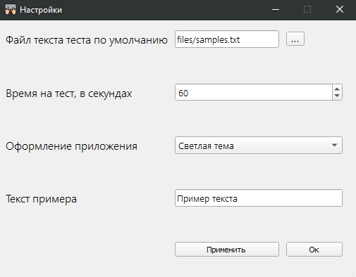

# Тест на скорость печати
Тест скорости печати на клавиатуре на основе Python и [PyQt5](https://doc.qt.io/qtforpython/).

## Вывод статистики
Записывает статистику тестов в **базу данных**, выводит данные за разные промежутки времени
в виде **графиков** в отдельном окне.

 

## Контекстное меню
Активируется нажатием **правой кнопки мыши**. Доступен выбор кастомного текста для теста, 
смена темы программы, быстрое закрытие

## Темная тема
Простая смена оформления приложения на **темную тему**

 

